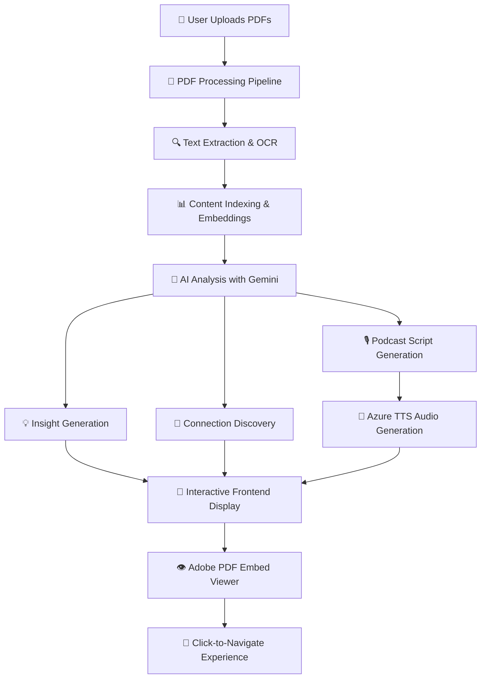

# 🏆 Adobe PDF Insights & Podcast Platform
## Grand Finale Submission - Complete AI-Powered Solution

<div align="center">

**🎯 One-Command Deployment Ready for Jury Evaluation**

[](./Dockerfile)
[](./frontend)
[](./backend)
[](https://developer.adobe.com/document-services/apis/pdf-embed/)
[](https://ai.google.dev/)
[](https://azure.microsoft.com/en-us/services/cognitive-services/text-to-speech/)

</div>

---

## 📋 Project Overview

**Adobe PDF Insights & Podcast Platform** is an innovative AI-powered solution that transforms static PDF documents into interactive, connected knowledge bases with intelligent insights and audio experiences. Built with cutting-edge technologies, this platform enables users to upload multiple PDFs, discover semantic connections between content, generate AI-powered insights, and create engaging podcast experiences.

### 🎯 Project Objectives
- **Transform PDF Reading Experience** - Convert static documents into interactive, searchable content
- **Intelligent Content Discovery** - Use AI to find hidden connections and relationships between documents
- **Multi-Modal Content Generation** - Create both visual insights and audio podcast experiences
- **Seamless User Experience** - Provide intuitive navigation and real-time interactions

---

## 🚀 How to Run the Project (Jury Instructions)

### ⚡ One-Command Deployment

```bash
# Method 1: Use our deployment script (Recommended for Jury)
./run-jury.sh        # Linux/Mac
run-jury.bat         # Windows

# Method 2: Direct Docker Compose (Alternative)
docker-compose up --build

# Method 3: Docker Build (Manual)
docker build -t adobe-pdf-platform .
docker run -p 8080:8080 adobe-pdf-platform
```

### 🌐 Access Points
- **Main Application**: http://localhost:8080
- **API Documentation**: http://localhost:8080/docs  
- **Health Check**: http://localhost:8080/health

### ✅ Quick Verification Steps
1. Run deployment command
2. Wait for container startup 
3. Visit http://localhost:8080/health to verify
4. Access main application at http://localhost:8080
5. Upload sample PDFs and explore features

---

## 🧠 Approach Used in Project

### 🔬 AI-First Architecture
Our solution leverages a multi-layered AI approach combining **Google Gemini AI** for content understanding and **Azure Cognitive Services** for speech synthesis, creating a comprehensive intelligent document processing pipeline.

### 🏗️ System Design Philosophy
```
📊 Input Layer (PDFs) 
    ↓
🔄 Processing Pipeline (PDF → Text → Embeddings)
    ↓
🧠 AI Analysis Layer (Gemini AI + Custom Algorithms)
    ↓ 
💡 Insight Generation (5 Types of Insights)
    ↓
🎙️ Multi-Modal Output (Visual + Audio)
```

### 🎯 Key Technical Decisions
- **Single Container Deployment** - Simplified jury evaluation process
- **TF-IDF + Semantic Search** - Balanced performance and accuracy
- **Modular AI Pipeline** - Scalable insight generation system
- **Adobe PDF Embed API** - Native PDF viewing with navigation
- **Real-time Processing** - Immediate feedback and interactions

---

## 🌟 Main Features

### 🔍 **1. Semantic Search Engine**
- **Cross-Document Search** - Find content across all uploaded PDFs simultaneously
- **Intelligent Ranking** - TF-IDF algorithm with semantic understanding
- **Contextual Results** - Highlights relevant sections with page navigation
- **Real-time Indexing** - Instant search capability upon PDF upload

### 🤝 **2. Connecting PDFs**
- **Intelligent Relationship Discovery** - AI identifies thematic connections between documents
- **Visual Connection Mapping** - Interactive visualization of document relationships
- **Contextual Linking** - Click-to-navigate between related content sections
- **Cross-Reference Generation** - Automatic creation of content bridges

### 💡 **3. Detailed AI Insights (5 Types)**
Our comprehensive insight system provides deep content analysis:

#### **🎯 Key Takeaways**
- Main points and conclusions from documents
- Summarized action items and recommendations
- Critical information extraction

#### **⚔️ Contradictions & Conflicts**
- Identifies conflicting information across documents
- Highlights inconsistencies and debates
- Provides balanced perspective analysis

#### **📚 Examples & Case Studies**
- Extracts practical examples and real-world applications
- Identifies case studies and success stories
- Links theoretical concepts to practical implementations

#### **🔗 Cross-References**
- Finds connections between different document sections
- Creates intelligent content bridges
- Enables seamless knowledge navigation

#### **📊 Facts & Statistics**
- Extracts numerical data and statistical information
- Identifies key metrics and performance indicators
- Provides data-driven insights

### 🎙️ **4. Podcast Mode**
- **AI-Generated Scripts** - Converts document content into engaging audio narratives
- **Multiple Voice Options** - Different speakers and voice personalities
- **Natural Conversations** - AI creates dialogue between virtual hosts
- **Audio Export** - Download podcast episodes in MP3 format
- **Chapter Markers** - Navigate through different document sections

---

## 🔄 System Workflow

### 📋 Complete User Journey



### 🔄 Technical Processing Flow

1. **📤 Upload Phase**
   - Drag & drop PDF files
   - Automatic file validation
   - Metadata extraction

2. **⚙️ Processing Phase**
   - PDF text extraction using PyPDF2
   - Content outline generation
   - TF-IDF indexing for search

3. **🧠 AI Analysis Phase**
   - Google Gemini AI content analysis
   - Semantic relationship mapping
   - Insight categorization and generation

4. **🎨 Presentation Phase**
   - Real-time UI updates
   - Interactive Adobe PDF viewer
   - Dynamic insight display

5. **🎙️ Audio Generation Phase**
   - AI script generation for podcasts
   - Azure TTS voice synthesis
   - Audio file optimization

---

## 📁 Folder Structure

### 🏗️ High-Level Architecture
```
adobe-round-3/                    # Root project directory
├── 🐳 Deployment Files
│   ├── Dockerfile                # Multi-stage container build
│   ├── docker-compose.yml        # One-command deployment
│   ├── run-jury.sh/.bat         # Jury evaluation scripts
│   └── .dockerignore            # Docker build optimization
│
├── 🖥️ Backend (FastAPI + Python)
│   ├── main.py                  # Application entry point
│   ├── config.py                # Global configuration
│   ├── requirements.txt         # Python dependencies
│   ├── .env                     # Environment variables
│   │
│   ├── 🌐 api/                  # API endpoints layer
│   │   ├── documents.py         # PDF upload & management
│   │   ├── search.py            # Semantic search engine
│   │   ├── insights.py          # AI insight generation
│   │   ├── connections.py       # Document relationship discovery
│   │   └── podcast.py           # Audio content generation
│   │
│   ├── 🔧 services/             # Business logic layer
│   │   ├── document_service.py  # PDF processing pipeline
│   │   ├── search_service.py    # Search algorithm implementation
│   │   ├── insights_service.py  # AI insight generation logic
│   │   └── podcast_service.py   # Audio generation workflow
│   │
│   ├── 📊 models/               # Data models & schemas
│   │   ├── document_model.py    # PDF document structures
│   │   ├── insights_model.py    # Insight data models
│   │   └── connection_model.py  # Relationship models
│   │
│   ├── 🔄 outline_engine/       # PDF processing engine
│   │   ├── rule_engine/         # Content analysis rules
│   │   └── shared_utils/        # Common utilities
│   │
│   ├── 🛠️ utils/                # Core utilities
│   │   ├── core_llm.py          # LLM client management
│   │   ├── llm_client.py        # AI interaction layer
│   │   ├── pdf_utils.py         # PDF processing utilities
│   │   └── tts_client.py        # Text-to-speech integration
│   │
│   └── 💾 storage/              # Data persistence
│       ├── pdfs/                # Uploaded PDF files
│       ├── outlines/            # Generated document outlines
│       ├── audio/               # Generated podcast files
│       └── documents_index.json # Search index data
│
└── 🎨 Frontend (React + TypeScript)
    ├── package.json             # Node.js dependencies
    ├── vite.config.js           # Build configuration
    ├── tailwind.config.js       # Styling framework
    ├── .env                     # Frontend environment
    │
    ├── 🌐 public/               # Static assets
    │   ├── favicon.ico          # Application icon
    │   └── sample/              # Demo PDF files
    │
    └── 📂 src/                  # React application
        ├── App.jsx              # Main application component
        ├── main.jsx             # Application entry point
        │
        ├── 🧩 components/       # Reusable UI components
        │   ├── PDFViewer/       # Adobe Embed integration
        │   ├── SearchBar/       # Search interface
        │   ├── InsightBulb/     # AI insights display
        │   ├── ConnectionMap/   # Document relationships
        │   └── PodcastPlayer/   # Audio playback
        │
        ├── 🔧 services/         # Frontend API integration
        │   ├── api.js           # Backend communication
        │   ├── pdfService.js    # PDF management
        │   └── audioService.js  # Audio handling
        │
        └── 🎨 utils/            # Frontend utilities
            ├── constants.js     # Application constants
            └── helpers.js       # Common functions
```

---

## 🛠️ Tech Stack

### 🖥️ **Backend Technologies**
- **🐍 Python 3.11** - Core programming language
- **⚡ FastAPI** - High-performance web framework
- **🧠 Google Gemini AI** - Advanced language model for content analysis
- **🎵 Azure Cognitive Services** - Text-to-speech synthesis
- **📄 PyPDF2** - PDF text extraction and processing
- **🔍 Scikit-learn** - TF-IDF implementation for search
- **🐳 Docker** - Containerization and deployment

### 🎨 **Frontend Technologies**
- **⚛️ React 19** - Modern UI library with latest features
- **⚡ Vite** - Lightning-fast build tool and dev server
- **🎨 TailwindCSS** - Utility-first CSS framework
- **✨ Framer Motion** - Smooth animations and transitions
- **📄 Adobe PDF Embed API** - Native PDF viewing capabilities
- **🎵 Web Audio API** - Audio playback and controls

### 🔧 **DevOps & Deployment**
- **🐳 Docker & Docker Compose** - Single-command deployment
- **🏗️ Multi-stage Builds** - Optimized container size
- **📋 Health Checks** - Application monitoring
- **📊 Logging** - Comprehensive error tracking

---

## 🔄 Frontend-Backend Interaction

### 🌐 API Communication Pattern

```
🎨 React Frontend                    🔧 FastAPI Backend
    │                                      │
    ├── 📤 POST /api/documents/upload ────→ 📄 PDF Processing
    │                                      ├── Text Extraction
    │                                      ├── Outline Generation
    │                                      └── Index Creation
    │                                      │
    ├── 🔍 POST /api/search ──────────────→ 🔍 TF-IDF Search
    │                                      ├── Query Processing
    │                                      ├── Relevance Scoring
    │                                      └── Result Ranking
    │                                      │
    ├── 💡 POST /api/insights/generate ───→ 🧠 AI Analysis
    │                                      ├── Gemini AI Processing
    │                                      ├── Content Categorization
    │                                      └── Insight Generation
    │                                      │
    ├── 🤝 POST /api/connections/find ────→ 🔗 Relationship Discovery
    │                                      ├── Semantic Analysis
    │                                      ├── Cross-Document Mapping
    │                                      └── Connection Scoring
    │                                      │
    └── 🎙️ POST /api/podcast/generate ────→ 🎵 Audio Generation
                                          ├── Script Creation
                                          ├── Azure TTS Processing
                                          └── Audio File Generation
```

### 🔄 Real-time Data Flow
1. **📤 File Upload** - FormData with progress tracking
2. **⚡ WebSocket Events** - Real-time processing updates
3. **🔄 State Management** - React hooks for data synchronization
4. **🎨 Dynamic UI Updates** - Immediate visual feedback
5. **📱 Responsive Design** - Mobile-first approach

---

## 🌐 API Overview

### 📋 Core Endpoints

#### 📄 **Document Management**
```bash
POST /api/documents/upload          # Upload PDF files
GET  /api/documents                 # List all documents
GET  /api/documents/{id}           # Get document details
DELETE /api/documents/{id}         # Remove document
```

#### 🔍 **Search & Discovery**
```bash
POST /api/search                   # Semantic content search
POST /api/search/advanced          # Advanced search with filters
GET  /api/search/suggestions       # Search autocomplete
```

#### 💡 **AI Insights**
```bash
POST /api/insights/generate        # Generate AI insights
GET  /api/insights/{document_id}   # Get document insights
POST /api/insights/batch           # Bulk insight generation
```

#### 🤝 **Content Connections**
```bash
POST /api/connections/find         # Discover document relationships
GET  /api/connections/{doc_id}     # Get connection map
POST /api/connections/suggest      # Suggest related content
```

#### 🎙️ **Podcast Generation**
```bash
POST /api/podcast/generate         # Create podcast from documents
GET  /api/podcast/{id}            # Download audio file
POST /api/podcast/script          # Generate script only
```

### 🔧 **System APIs**
```bash
GET  /health                      # Application health check
GET  /docs                        # Interactive API documentation
GET  /metrics                     # Performance metrics
```

---

## 🎯 Advanced Features & Minor Details

### 🔍 **Advanced Search Capabilities**

#### **📄 Search Within Individual PDFs**
- Document-specific search with precise page targeting
- Section-based filtering by headings and subheadings
- Contextual snippet preview with highlighting

#### **🌐 Cross-PDF Search by Headings**
- Hierarchical search across document structures
- Heading-level navigation with automatic bookmark creation
- Smart categorization by content types

#### **⚡ Intelligent Search Suggestions**
- Auto-complete based on document content
- Contextual query recommendations
- Search history and favorites

### 📱 **Multi-PDF Management**

#### **📚 Simultaneous PDF Opening**
- Side-by-side document comparison
- Tabbed interface for multiple documents
- Synchronized scrolling and navigation
- Cross-document annotation and highlighting

#### **🔄 Document State Management**
- Remember reading position across sessions
- Bookmark and favorite page management
- Reading progress tracking
- Document-specific note-taking

### 🧭 **Advanced PDF Navigation**

#### **🎯 Direct Page Navigation**
- Click-to-jump functionality from search results
- Automatic text highlighting at destination
- Smooth scroll transitions with visual indicators
- Breadcrumb navigation for complex documents

#### **🔗 Smart Cross-References**
- Intelligent linking between related sections
- Visual connection indicators
- One-click navigation between references
- Context preservation during navigation

### 💡 **Comprehensive Insight Types**

#### **🎯 Enhanced Takeaways**
- Executive summaries with action items
- Key concept extraction with definitions
- Priority-based recommendation ranking
- Personalized insight filtering

#### **⚔️ Advanced Contradiction Analysis**
- Sentiment analysis of conflicting viewpoints
- Evidence strength assessment
- Bias detection and neutrality scoring
- Balanced perspective presentation

#### **📚 Rich Examples & Case Studies**
- Interactive example exploration
- Success/failure pattern recognition
- Industry-specific case categorization
- Practical application suggestions

#### **🔗 Intelligent Cross-References**
- Semantic relationship mapping
- Concept clustering and grouping
- Reference strength scoring
- Visual relationship networks

#### **📊 Data-Driven Facts**
- Statistical trend analysis
- Fact verification and source tracking
- Comparative analysis across documents
- Data visualization integration

### 🎙️ **Advanced Podcast Features**

#### **🎭 Multiple Speaker Personalities**
- **Professional Analyst** - Formal, data-driven commentary
- **Conversational Host** - Friendly, accessible explanations
- **Expert Interviewer** - Probing questions and deep dives
- **Storyteller** - Narrative-driven content presentation

#### **🎵 Voice Customization Options**
- Male/Female voice selections
- Regional accent variations
- Speaking pace adjustments
- Emotional tone modulation

#### **📋 Enhanced Script Generation**
- Chapter-based content organization
- Interactive transcript with timestamps
- Key point emphasis and highlighting
- Customizable content focus areas

#### **🎧 Professional Audio Features**
- Background music integration
- Audio quality optimization
- Chapter markers for easy navigation
- Export in multiple audio formats

### 🎨 **User Experience Enhancements**

#### **⚡ Performance Optimizations**
- Lazy loading for large documents
- Progressive PDF rendering
- Caching for frequently accessed content
- Optimized search indexing

#### **🎯 Accessibility Features**
- Screen reader compatibility
- Keyboard navigation support
- High contrast mode options
- Text size adjustment controls

#### **📱 Responsive Design**
- Mobile-optimized PDF viewing
- Touch-friendly navigation controls
- Adaptive layout for different screen sizes
- Offline functionality for uploaded documents

### 🔧 **Developer & Admin Features**

#### **📊 Analytics Dashboard**
- Usage statistics and metrics
- Performance monitoring
- Error tracking and logging
- User behavior analysis

#### **🛠️ Configuration Options**
- AI model parameter tuning
- Search algorithm customization
- UI theme and layout options
- API rate limiting controls

#### **🔒 Security Enhancements**
- File type validation and sanitization
- Rate limiting for API endpoints
- Session management and timeouts
- Data encryption for sensitive content

---

<div align="center">

## 🎉 Ready for Jury Evaluation!

### 🚀 **Quick Start Command**
```bash
docker-compose up --build
```

### 🌐 **Access Application**
**http://localhost:8080**

---

**🏆 Complete PDF Insights & Podcast Platform**
*Advanced AI • Seamless Navigation • Professional Audio • Modern UI*

**Built with ❤️ for Adobe Grand Finale Challenge**

</div>
